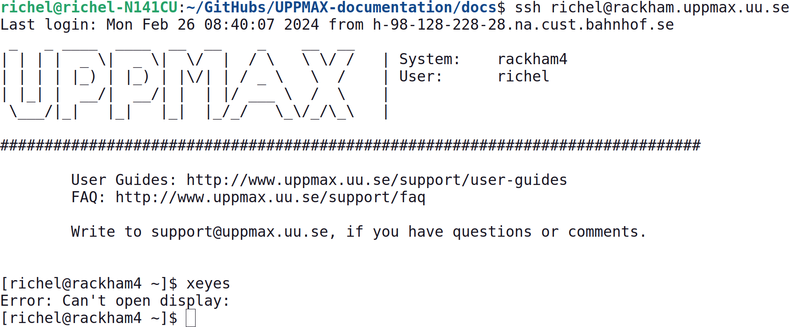

---
tags:
  - terminal
---

# Terminal



> A terminal.

A terminal is a program that allows you to run commands.

???- question "How to copy-paste to/from a terminal?"

    This depends on the terminal you use, however,
    this is the most common options:

    Press ++ctrl+shift+c++ for copy, &nbsp;++ctrl+shift+v++ for paste.

???- question "What does all the stuff on the line I can type on mean?"

    The text at the start of the line you can type on,
    is called the command prompt.

???- question "What is the command prompt?"

    The command prompt indicates
    that the terminal is waiting for user input.

    Here is an example prompt:

    ```bash
    [sven@pelle2 my_folder]$
    ```

    - `[` and `]` indicates the beginning and end of information
    - `sven` the username
    - `@` at ...
    - `pelle2` the computers name (called hostname),
      in this case Pelle's second login node
    - `my_folder` (part of) the path of the current directory,
      in this case, a folder called `my_folder`.
      The character `~` refers to the current users own home folder.
    - `$` ending the prompt, indicating that the computer is ready for user
      input (and which kind of prompt this is, if it is another character you
      are in some other environment or program, e.g. `>>>` indicates you're in
      Python)

    The hostname is useful to know where you are when working with multiple
    computers, e.g.:

    Name                    |Location
    ------------------------|---------------------------
    `pelle1` and `pelle2`   |A Pelle login node
    `p#`                    |A Pelle compute node
    `bianca`                |A Bianca login node
    `b#`                    |A Bianca compute node

