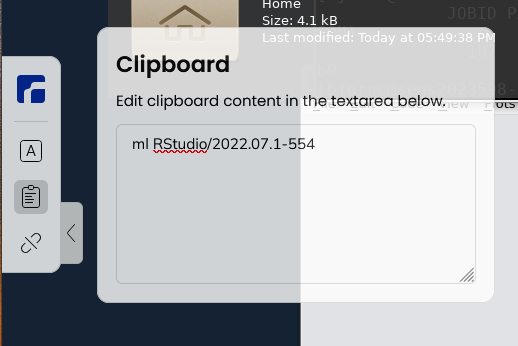

---
tags:
  - ThinLinc
  - local client
  - install
  - usage
  - copy-paste
---

# ThinLinc

> Remote desktop environment for Rackham, using the webbrowser login.

ThinLinc provides for a remote desktop environment for the UPPMAX clusters.

## Local ThinLinc client versus web browser

There are two ways of connecting to the clusters using ThinLinc,
using a local ThinLinc client or login using a webbrowser.
Here are the differences:

Parameter                                   |Local ThinLinc client|Web browser login
--------------------------------------------|---------------------|-----------------
[Bianca](../cluster_guides/bianca.md) use   |Impossible           |Possible
[Rackham](../cluster_guides/rackham.md) use |Recommended          |Possible
[Pelle](../cluster_guides/pelle.md) use     |Recommended          |:construction: Not yet possible
Install                                     |ThinLinc client      |Nothing [1]
Simplicity                                  |Easy                 |Trivial
Performance                                 |Higher               |Lower
Recommended for                             |Most use cases       |Small tasks, when other approach fails

- [1] You already have a webbrowser installed :-)

The first is by using the web client and connect from the browser.
This can be useful for smaller tasks
or if you are unable to install software on the computer you are currently using.
Please see below for more information.

The second option is to download the ThinLinc client,
which offers higher performance and is recommended for most users.
The client can be downloaded from the [official download page](https://www.cendio.com/thinlinc/download/).

- [ThinLinc on Bianca](../software/thinlinc_on_bianca.md)
- [ThinLinc on Rackham](../software/thinlinc_on_rackham.md)
- ThinLinc on Snowy: same as [ThinLinc on Rackham](../software/thinlinc_on_rackham.md)

## Installing ThinLinc

The ThinLinc client can be downloaded from the
[official Cendio download page](https://www.cendio.com/thinlinc/download/).

## ThinLinc usage

### How do I copy/paste within a ThinLinc session?"

- Windows/Mac: Right-click and choose, or
- Windows:
    - paste: `shift+insert`
    - copy: `ctrl+insert`

### How do I copy/paste between ThinLinc and locally?

ThinLinc has a clipboard where one can shuttle text via copy-pasting
inside/outside the ThinLinc remote desktop environment.

- Copy in ThinLinc by the ThinLinc command (see above) and it ends up here in the ThinLinc clipboard
    - Mark and copy with Windows/Mac command
    - Paste locally with Windows/Mac command

- Copy from locally
    - paste in the ThinLinc clipboard with Windows/Mac command
    - paste to ThinLinc place by the ThinLinc command (see above)

### Settings

Under the "Screen" tab, you can set the starting sise of the session
and choose to enable/disable Full screen mode.
Typically, users prefer to turn off full screen mode.

Normally you don't have to change anything else here,
and we have also disabled all "local devices" (USB-sticks, sound and printers)
on server side. So no point to fiddle with these specific options.

## Troubleshooting

- [ThinLinc error: no agent server was available](thinlinc_error_no_server_agent_was_available.md)
