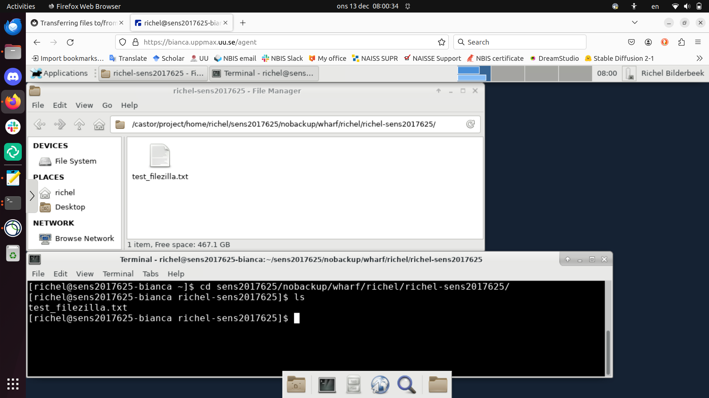

# ThinLinc on Bianca

> Bianca's remote desktop, using a webbrowser

[ThinLinc](../software/thinlinc.md) provides for a remote desktop environment
for the UPPMAX clusters.
This page describes how to use ThinLinc on [Bianca](../cluster_guides/bianca.md).

For Bianca, there is only one way to [access Bianca's remote desktop using a website](../getting_started/login_bianca_remote_desktop_website.md):
see [the UPPMAX page 'Login to the Bianca remote desktop environment website'](../getting_started/login_bianca_remote_desktop_website.md).

