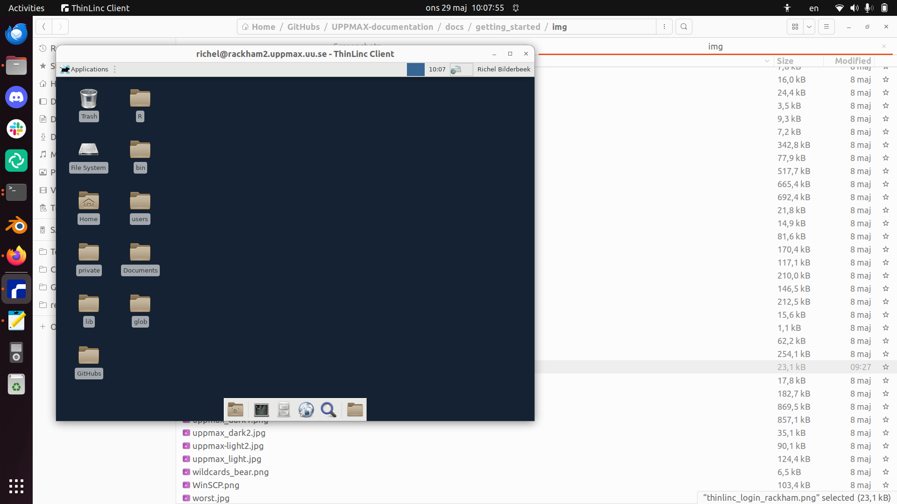

# ThinLinc on Rackham

> Rackham's remote desktop environment accessed via a webbrowser

[ThinLinc](../software/thinlinc.md) provides for a remote desktop environment
for the UPPMAX clusters.
This page describes how to use ThinLinc on [Rackham](../cluster_guides/rackham.md).

There are two ways of connecting to the clusters using ThinLinc:
using a local ThinLinc client or login using a webbrowser.
See [ThinLinc](../software/thinlinc.md) for a comparison.

## Local ThinLinc client

> Rackham's remote desktop environment accessed via a local ThinLinc client

See [the UPPMAX page 'Login to the Rackham remote desktop environment using a local ThinLinc client'](../getting_started/login_rackham_remote_desktop_local_thinlinc_client.md).

## Web browser login

> Rackham's remote desktop environment accessed via a webbrowser

See [the UPPMAX page 'Login to the Rackham remote desktop environment website'](../getting_started/login_rackham_remote_desktop_website.md).
