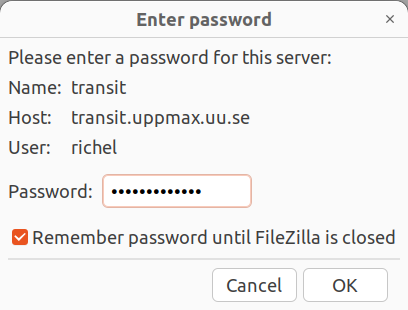
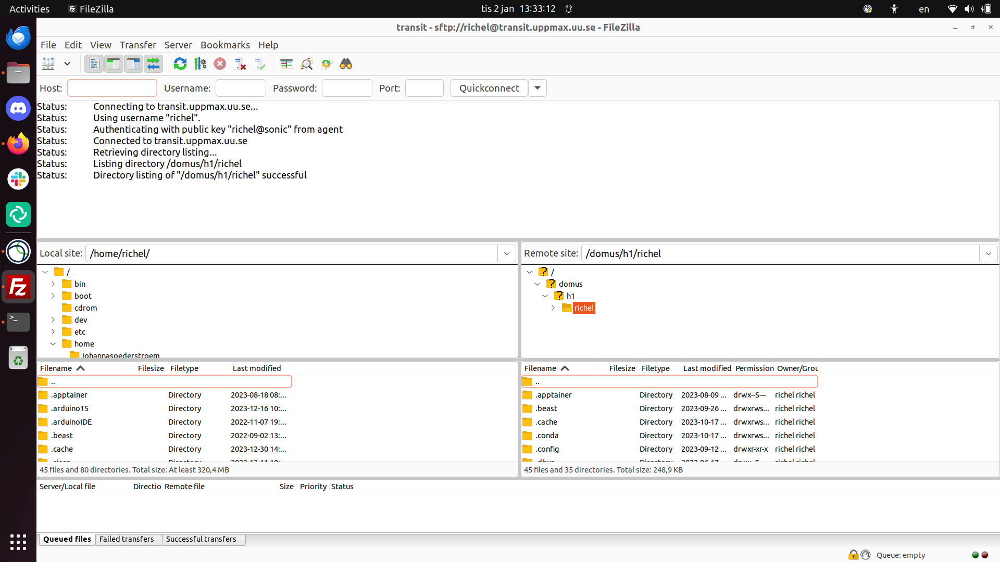

---
tags:
  - transfer
  - FileZilla
  - Transit
---

# File transfer to/from Transit using FileZilla

There are multiple ways to [transfer files to/from Transit using a graphical tool](../cluster_guides/transit_file_transfer_using_gui.md)

Here it is shown how to transfer files using a graphical tool called [FileZilla](filezilla.md).

???- question "What is Transit?"

    See [the page about the UPPMAX Transit server](../cluster_guides/transit.md).

## Procedure

> FileZilla connected to Transit

???- question "Would you like a video?"

    If you like to see how to do file transfer from/to Transit
    using FileZilla, watch the video
    [here](https://youtu.be/ShZPFkZ3reg)

FileZilla is a secure file transfer tool that works under Linux, Mac and Windows.

To transfer files to/from Transit using FileZilla, do:

### 1. Get inside SUNET

???- question "Forgot how to get within SUNET?"

    See the 'get inside the university networks' page [here](../getting_started/get_inside_sunet.md)

### 2. Start FileZilla

### 3. From the menu, select 'File | Site manager'

???- tip "Where is that?"

    It is here:

    

    > The FileZilla 'File' menu contains the item 'Site manager'

### 4. Click 'New site'

???- tip "Where is that?"

    It is here:

    

### 5. Create a name for the site

Create a name for the site, e.g. Transit.

### 6. Setup the site

For that site, use all standards, except:

- Set protocol to 'SFTP - SSH File Transfer Protocol'
- Set host to `transit.uppmax.uu.se`
- Set user to `[username]`, e.g. `sven`

???- tip "How does that look like?"

    It looks similar to this:

    

### 7. Click 'Connect'

### 8. You will be asked for your password

You will be asked for your password, hence
type `[your password]`, e.g. `VerySecret`.
You can save the password.

???- tip "How does that look like?"

    It looks similar to this:

    

### 9. Transfer files between local and Transit

Now you can transfer files between your local computer and Transit.

???- tip "How does that look like?"

    It looks like this:

    

## Where do my files end up?

They *seem* to end up in your Transit home folder.

Its location is at `/home/[user_name]`,
for example, at `/home/sven`.

However, this is not the case:
upon closing FileZilla,
the files you've uploaded are gone.

You do need to transfer these files to other HPC clusters
before closing FileZilla.
For detailed instructions, see the guides at the respective cluster, among others:

- Bianca file transfer using Transit
- [Rackham file transfer using Transit](../cluster_guides/rackham_file_transfer_using_transit.md)

## Extra material

### WinSCP

WinSCP is a secure file transfer tool that works under Windows.

To transfer files to/from Transit using WinSCP, do:

- Start WinSCP
- Create a new site
- For that site, use all standards, except:
    - Set file protocol to 'SFTP'
    - Set host name to `transit.uppmax.uu.se`
    - Set user name to `[username]`, e.g. `sven`
