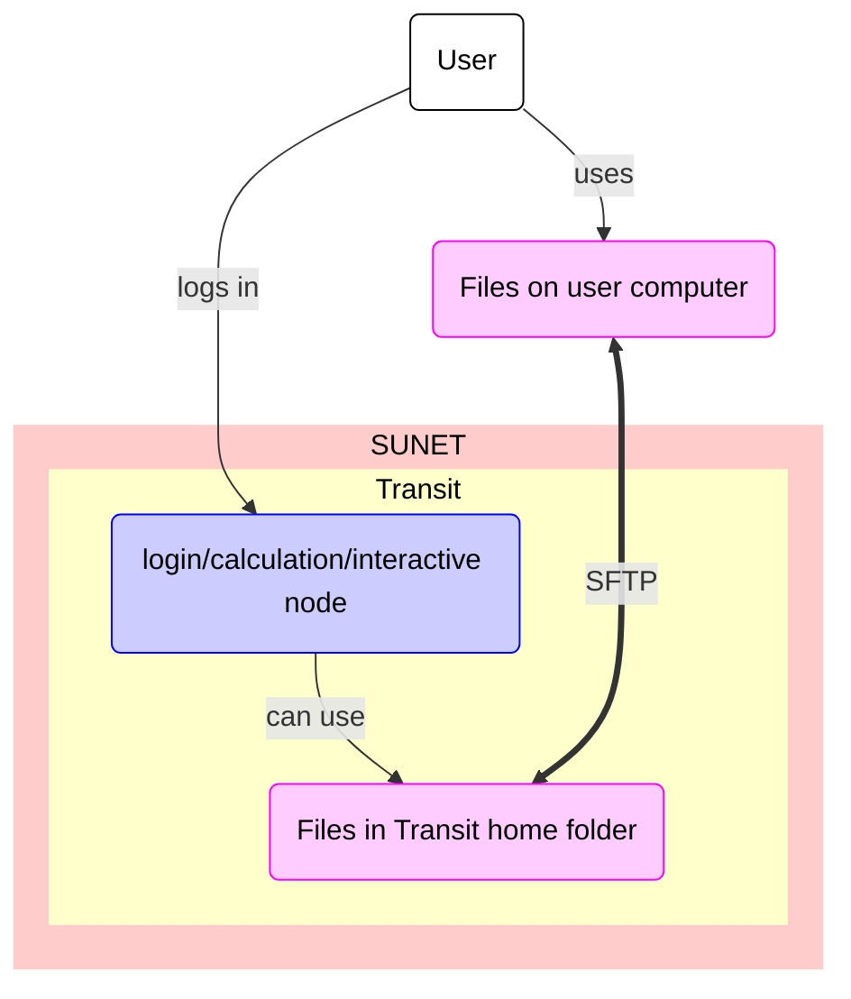

---
tags:
  - transfer
  - SFTP
  - sftp
  - Transit
---

# Data transfer to/from Transit using SFTP

Data transfer to/from [Transit](../cluster_guides/transit.md) using SFTP
is one of the ways ways to [transfer files to/from Transit](../cluster_guides/transfer_transit.md).

???- question "What is Transit?"

    See [the page about the UPPMAX Transit server](../cluster_guides/transit.md).

???- question "What are the other ways?"

    See [the other ways to transfer data to/from Transit](../cluster_guides/transfer_transit.md)

One can transfer files to/from Transit using SFTP.
SFTP is an abbreviation of 'SSH File Transfer Protocol',
where 'SSH' is an abbreviation of 'Secure Shell protocol'
The program `sftp` allows you to transfer files to/from Transit using SFTP.

## Using SFTP

The procedure is described in the following steps.

### 1. Get inside SUNET

Get inside SUNET.

???- question "Forgot how to get within SUNET?"

    See [the 'get inside the university networks' page](../getting_started/get_inside_sunet.md)

### 2. Start a terminal on your local computer

Start a [terminal](../software/terminal.md) on your local computer.

### 3. Connect `sftp` to Transit

In the terminal, connect `sftp` to Transit by doing:

```bash
sftp [username]@transit.uppmax.uu.se
```

where `[username]` is your UPPMAX username, for example:

```bash
sftp sven@transit.uppmax.uu.se
```

If asked, give your UPPMAX password.
You can get rid of this prompt if you have setup SSH keys.

### 5. In `sftp`, upload/download files to/from Transit

In `sftp`, upload/download files to/from Transit.

For example, to upload a file to Transit:

```bash
put my_file.txt
```

Basic `sftp` command can be found [here](../software/sftp.md).

## Where do my files end up?

They *seem* to end up in your Transit home folder.

Its location is at `/home/[user_name]`,
for example, at `/home/sven`.

However, this is not the case:
upon closing `sftp`,
the files you've uploaded are gone.

You do need to transfer these files to other HPC clusters
before closing `sftp`.
For detailed instructions, see the guides at the respective cluster, among others:

* [Rackham file transfer using SFTP](rackham_file_transfer_using_sftp.md)

## Overview



> Overview of file transfer on Transit
> The purple nodes are about file transfer,
> the blue nodes are about 'doing other things'.
> The user can be either inside or outside SUNET.
