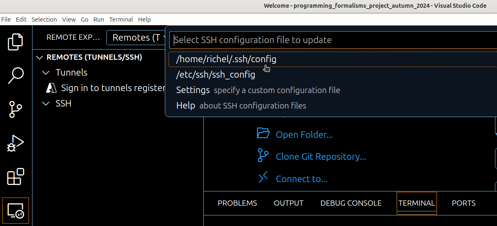
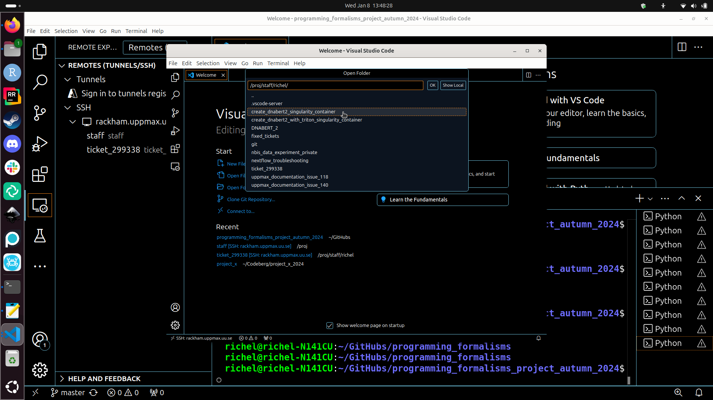

---
tags:
  - VSCode
  - Rackham
  - connect
---

# Connecting Visual Studio Code to Rackham

> VSCode from a local computer working on Rackham.

## Introduction

Visual Studio Code ('VSCode') is an [IDE](../software/ides.md)
that can be used for software development in many languages.

???- tip "What is an IDE?"

    See [the page on IDEs](../software/ides.md).

In this session, we show how to connect VSCode on your local computer
to work with your files on Rackham.

## Procedure

Below is a step-by-step procedure to start VSCode.

???- question "Prefer a video?"

    See [this YouTube video](https://youtu.be/MkrKi5oU_po).

    An older version of this procedure, where the 'Remote Tunnel'
    extension is used, can be seen in [this YouTube video](https://youtu.be/RG2FWA8yoUs).

### 1. Install VSCode on your local computer

Install VSCode on your local computer.

### 2. Start VSCode on your local computer

???- question "How does that look like?"

    

### 3. In VSCode, install the VSCode 'Remote-SSH' plugin

In VSCode, install the VSCode 'Remote-SSH' plugin.

???- question "How does that look like?"

    

### 4. In the 'Remote Explorer' tab, at SSH, click the plus

In VSCode, go to the 'Remote Explorer' tab.
At the SSH section, click on the '+' (with tooltip 'New remote').

???- question "How does that look like?"

    

### 5. Give the SSH command to connect to Rackham

In the main edit bar, give the SSH command to connect to Rackham,
e.g. `ssh sven@rackham.uppmax.uu.se`

???- question "How does that look like?"

    

### 6. Pick the a location for the SSH config file

In the dropdown menu, pick the a location for the SSH config file,
e.g. the first, which is similar to `/home/sven/.ssh/config`.

???- question "How does that look like?"

    

### 7. Click 'Connect'

In the bottom left of VSCode, click on the popup window 'Connect'.

???- question "How does that look like?"

### 8. Done

You are now connected: there is a new window with VSCode connected to Rackham.

???- question "How does that look like?"

    The window that is connected to a Rackham home folder:

    

    Going to `/proj/staff`:

    

## Setting up VSCode for Rackham and Snowy

!!! info

    - You can run VSCode on your local and still be able to work with modules loaded or environment created on Rackham.  
    - Similarly it is possible to take advantage of Snowy GPUs meanwhile developing on your local computer.  

### 1. Connect your local VSCode to VSCode server running on Rackham

Perform steps mentioned under the section [Procedure to start VSCode](#procedure).

When you first establish the ssh connection to Rackham, your VSCode server directory `.vscode-server` will be created in your home folder `/home/[username]`.  

### 2. Install and manage Extensions on remote VSCode server

By default all the VSCode extensions will get installed on your home folder `/home/[username]`. Due to less storage quota on home folder `32 GB, 300k files`, can quickly fill up with extensions and other file operations. The default installation path for VSCode extensions can however be changed to your project folder which have way more storage space and file count capacity, `1TB, 1M files`.

#### 2.1. Manage Extensions

Go to Command Palette `Ctrl+Shift+P` or `F1`. Search for `Remote-SSH: Settings` and then go to `Remote.SSH: Server Install Path`. Add **Item** as remote host `rackham.uppmax.uu.se` and **Value** as folder in which you want to install all your data and extensions `/proj/uppmax202x-x-xx/nobackup` (without a trailing slash `/`).  

If you already had your `vscode-server` running and storing extensions in home directory. Make sure to kill the server by selecting `Remote-SSH: KIll VS Code Server on Host` on Command Palette and deleting the `.vscode-server` directory in your home folder.  

#### 2.2. Install Extensions

You can sync all your local VSCode extensions to the remote server after you are connected with VSCode server on Rackham by searching for `Remote: Install Local Extensions in 'SSH: rackham.uppmax.uu.se'` in Command Palette. You can alternatively, go to Extensions tab and select each individually.  

#### 2.3. Selecting Kernels

Request allocation in either Rackham or Snowy compute node depending on your need, for that use `interactive` slurm command. Load the correct module on Rackham/Snowy that you contains the interpret you want on your VSCode. For example in case you need ML packages and python interpreter, do `module load python_ML_packages`. Check the file path for python interpreter by checking `which python` and copy this path. Go to Command Palette `Ctrl+Shift+P` or `F1` on your local VSCode. Search for "interpreter" for python, then paste the path of your interpreter/kernel.  

`venv` or `conda` environments are also visible on VSCode when you select interpreter/kernel for python or jupyter server. For jupyter, you need to start the server first, check Point 3.

### 3. Working with jupyter server on Rackham and snowy

#### Rackham

Module load jupyter packages either from `module load python` or `module load python_ML_packages` as per your needs. For heavy compute and longer running jupyter server, allocate a Rackham compute node instead of using login node. Either request for rackham compute node by using, for example, `interactive -A uppmax202x-x-xx -p node -N 1 -t 2:00:00` or move to the next step to run jupyter on login node itself. Start the jupyter server `jupyter notebook --ip 0.0.0.0 --no-browser`. Copy the jupyter server URL which goes something like `http://r52.uppmax.uu.se:8888/tree?token=xxx`, click on **Select Kernel** on VSCode and select **Existing Jupyter Server**. Past the URL here and confirm your choice.  

#### Snowy

Start an interactive session with GPU allocation on Snowy `interactive -A uppmax202x-x-xx -p node -N 1 -t 02:00:00 --gres=gpu:1 -M snowy`. Module load the jupyter packages `module load python_ML_packages` and start the jupyter server `jupyter notebook --ip 0.0.0.0 --no-browser`. This should start a jupyter server on Snowy compute node with one T4 GPU. Copy the URL of the running jupyter server which goes something like `http://s193.uppmax.uu.se:8888/tree?token=xxx` and paste it in the jupyter kernel path on your local VSCode. The application will automatically perform port forwarding to Rackham, which already is listening to Snowy compute nodes over certain ports.
