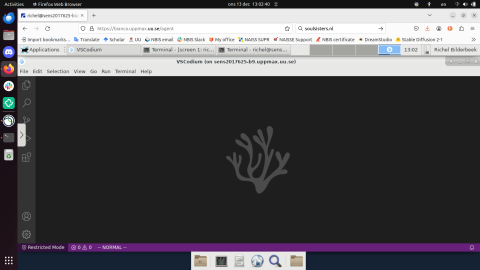

---
tags:
  - VSCodium
---

# VSCodium

VSCodium is the community edition of [Visual Studio Code](vscode.md)
and is an [IDE](../software/ides.md) that can be used for software development in many languages.

> VSCodium running on Bianca

If you can use VSCodium, depends on the HPC cluster:

Cluster                                 | Works/fails |Documentation page
----------------------------------------|-------------|---------------------------------------------------------------
[Bianca](../cluster_guides/bianca.md)   | Works       |[VSCodium on Bianca](../software/vscodium_on_bianca.md)
[Pelle](../cluster_guides/pelle.md) | Fails [1]   |None

- [1] Use [VSCode on Pelle](../software/vscode_on_pelle.md) instead
