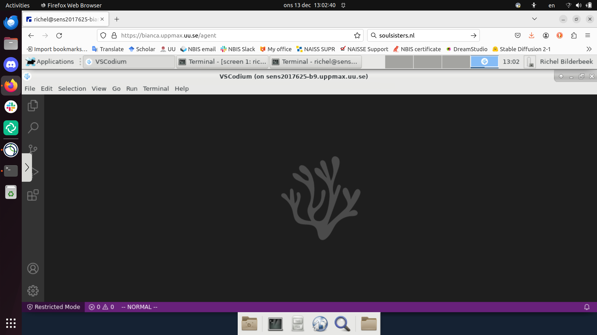

---
tags:
  - VSCodium
  - Bianca
---

# Using VSCodium on Bianca


> VSCodium running on Bianca

## Introduction

There are multiple [IDEs on Bianca](../software/ides_on_bianca.md),
among other [VSCodium](../software/vscodium.md).
Here we discuss how to run [VSCodium](../software/vscodium.md)
on [Bianca](../cluster_guides/bianca.md).

VSCodium is the community edition of Visual Studio Code
and can be used for software development in many languages.

???- tip "What is an IDE?"

    See [the page on IDEs](../software/ides.md).

In this session, we show how to use VSCodium on Bianca,
using Bianca's remote desktop environment.

???- tip "Forgot how to login to a remote desktop environment?"

    See [the 'Logging in to Bianca' page](../getting_started/login_bianca.md).

As VSCodium is a resource-heavy program,
it must be run on an interactive session.

## Procedure to start VSCodium

Below is a step-by-step procedure to start RStudio.
This procedure is also demonstrated in [this YouTube video](https://youtu.be/i7sjHOX4B_M).

### 1. Get within SUNET

???- question "Forgot how to get within SUNET?"

    See [the 'get inside the university networks' page](../getting_started/get_inside_sunet.md)

### 2. Start the Bianca remote desktop environment

???- tip "Forgot how to start Bianca's remote desktop environment?"

    See [the 'Logging in to Bianca' page](../getting_started/login_bianca.md).

### 3. Start an interactive session

Within the Bianca remote desktop environment, start a [terminal](../software/terminal.md).
Within that terminal, start an interactive session with 1 core.

???- tip "Forgot how to start an interactive session?"

    See [the 'Starting an interactive session' page](../cluster_guides/start_interactive_session_on_bianca.md).

    Spoiler: use:

    ```bash
    interactive -A sens2023598 -n 1 -t 8:00:00
    ```

### 4. Load the modules needed

VSCodium needs the `VSCodium/latest` module.

In the terminal of the interactive session, do:

```bash
module load VSCodium/latest
```

### 5. Start VSCodium

With the modules loaded,
in that same terminal,
start VSCodium:

```bash
code
```

VSCodium starts up quickly.

???- info "How does VSCodium look on Bianca?"

    
