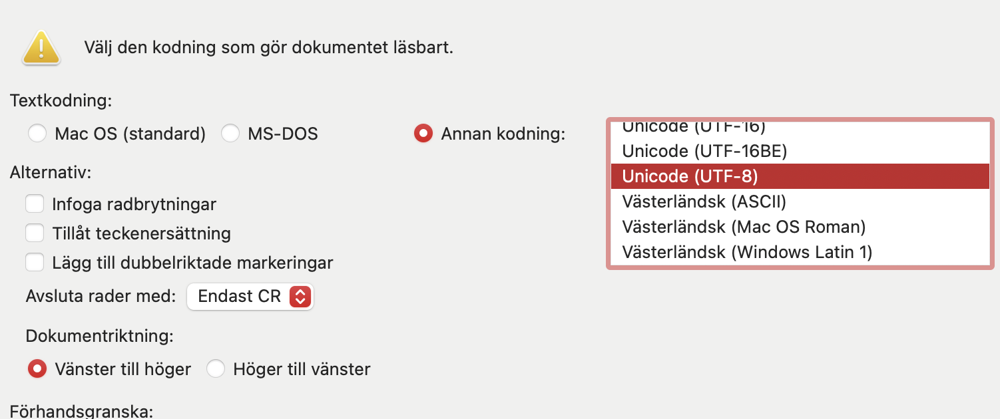

---
tags:
  - Whisper
---

# Whisper

## Introduction

This guide provides instructions for loading and using OpenAI's Whisper, an
automatic speech recognition system. Whisper is available on Bianca. It can either be used through a User Interface or loaded as a Module.

!!! warning "AI tool caution"

    Like all other AI models, Whisper too hallucinates while transcribing or translating. ie, "make-up" words or even sentences, resulting in misinterpretation or misrepresentation of the speaker.  


??? info "Quality of transcriptions and translations"  

    Transcriptions (error rate):-  Swedish: ~10% , English: ~5% , English with heavy accent: ~ 20%  
    
    Translations:- Any to English: "DeepL" level performance. Slightly better than google translate.  

    Supported file types: mp3, mp4, mpeg, mpga, m4a, wav, and webm.  

    Quality as a factor of duration of recordings:-  
    A few minutes: Excellent  
    A few minutes to an hour: Excellent at the beginning, then detoriates.
    An hour or more: Excellent at the beginning, then detoriates.  

    Quality as a factor of noise and count of speakers:-  
    2 speakers: Excellent  
    Background noise: Good  
    2+ speakers: Very Good  
    Conversational overlap: Average. Difficulty disambiguating speakers.  
    Long silences: Good. Might repeat sentences and get stuck in loop.

    Whisper also tries to give separate sentences for different speakers. But it is not guaranteed.  

## Glossary  

**SUPR account**  
**UPPMAX account**  
**GUI** : Graphical User Interface for taking transcription/translation inputs.  
**WinSCP / FileZilla**: user interface to send data from your computer to Bianca and vice-versa.  
**Terminal** : Black text-based environment that is used for performing jobs.  
**Wharf**: private folder in Bianca that is used to transfer data to and from your computer.  
**Proj**: project folder in Bianca that is shared among all project members.  
**Job**: A request for transcribing/translating one or many recordings.  
**Slurm**: "job" handler.  


## Accessing your project  

Following steps are derived from [UPPMAX User Accounts](https://www.uu.se/en/centre/uppmax/get-started/create-account-and-apply-for-project/user-account):  

!!! info inline end "Checklist"  

    * [x] SUPR account  
    * [x] UPPMAX username and password  
    * [x] UPPMAX two factor authentication.  

1. Register an [account on SUPR](https://supr.naiss.se/person/register/).  

2. Apply for a project for [sensitive data at Bianca](https://supr.naiss.se/round/senssmall2024/create_proposal).  

3. Register an [account for UPPMAX](https://supr.naiss.se/account/) at SUPR by clicking "Request Account at UPPMAX" button. You will receive an UPPMAX username and password via email.

4. [Setup two factor authentication](https://www.uu.se/en/centre/uppmax/get-started/2-factor) for this newly created UPPMAX account.  

5. Give adequate information while creating your proposal or follow [this template](#proposal-template).  

6. Check access to your project on [Bianca](https://bianca.uppmax.uu.se/).


## Application

### Step 1: Data transfer from local computer to Bianca  

1. Transfer your data from your local computer to Wharf using [WinSCP](https://docs.uppmax.uu.se/software/bianca_file_transfer_using_winscp/) client (for Windows only) or [FileZilla](https://docs.uppmax.uu.se/software/bianca_file_transfer_using_filezilla/) client (Mac, Windows or Linux). Instruction on how to do it is in their respective links.

### Step 2: Transcribing/Translating  

1. Login to [Bianca](https://bianca.uppmax.uu.se/). It requires your UPPMAX username (visible in SUPR), project name and two factor authentication code. Make sure you are inside SUNET for the link to work.  

1. Click on the Terminal icon on the bottom of the Desktop and enter the following command in it to load Whisper GUI.  

    ```bash
    module load Whisper-gui
    ```  

      

1. You shall now see `proj` and `wharf` folders on your Desktop along with a Whisper application icon. `wharf` contains the data that was transferred in [Step 1](#step-1-data-transfer-from-local-computer-to-bianca).  
(Next time you start transcribing/translating by logging in again to Bianca, you can start from this step and skip the previous one, since `wharf` and `proj` folder are already created.)

    

1. Open `wharf` and `proj` folder.  Select all the data that you transferred in `wharf`, drag and drop it into the  `proj` folder.  
NOTE: if you drag and drop, it will cut-paste your data instead of copy-paste. It is unsafe to keep data in `wharf` folder and the data should be deleted from it after the transfer is done.  
{: style="height:60%;width:60%"}

1. Click on Whisper application on Desktop. It would look like this:  
{: style="height:60%;width:60%"}


1. Select appropriate options, or use the following for the best results:  

    **Total audio length in hours**: [give a rough average if transcribing files in bulk, rounding up to nearest hour]  
    **Model**: large-v2  
    **Language used in recordings (leave blank for autodetection)**: If your language of choice is unavailable, check the "Languages available" list for its availability and [contact support](https://supr.naiss.se/support/).  

### Step 3: Monitoring jobs  

1. Your job will first wait in a queue and then start executing. To first check if your job is waiting in the queue, type `squeue --me -o "%.30j"` on terminal. If you see your job name `Whisper_xxx` it means it is in the queue, where `xxx` is the date and time of job submission, example: Whisper_2024-10-25_11-10-30.  

2. To check if your job has started executing, locate a file named `[Whisper_xxx_yyy].out` that will get created in `Whisper_logs` folder inside `proj` folder, where `xxx` is date and time of job submission and `yyy` is your username followed by a "job id", example: Whisper_2024-10-25_11-10-30_jayan_234.out. This contains a progress bar for each recording that you sent for transcribing/translating.  

3. If neither job name `Whisper_xxx` was found in queue, nor a `[Whisper_xxx_yyy].out` was created in `Whisper_logs`, [contact support](https://supr.naiss.se/support/).

### Step 4: Data transfer from project to local computer

1. Drag and drop your transcriptions/translations from `proj` folder to `wharf`.  

2. Use WinSCP/FileZilla like you did in [Step 1](#step-1-data-transfer-from-local-computer-to-bianca) and transfer your data from `wharf` to your local computer.

### Output files

By default you receive 5 types of output files for each file you transcribe/translate:  
With timestamps: `.srt`, `.vtt`, `.tsv`  
Without timestamps: `.txt`  
With detailed model metadata: `.json`.
The most popular ones are `.srt` and `.txt` formats.  

On Mac, `.srt` and `.vtt` can be opened in Word by:  
Tap with two fingers. Select Encoding as "Unicode (UTF-8)". Change the name of the file like `some_name.docx` and change type of file to `.docx`. Open the file and then Save As a new file.  
{: style="height:60%;width:60%"}  

??? tip "Advance settings"

    Use below features only if transcriptions/translations are not satisfactory and for less spoken languages or languages that are not having good resources online for understanding :

    1. When asked for Initial Prompt, provide a list of comma separated words or sentences (less than 80 words) that describe what the recording is about or the words used by the speaker in the recording. It should be in written in same language as the language in spoken in the recordings.  

    2. Try switching to Model: large-v3.  

    3. Use combination of both 1 and 2.  

    4. If you are sure about the language used in the recording, use the dropdown menu and select the appropriate language.  

??? note "Languages available"

    Following languages are available for transcribing. If your language of choice does not appear in Whisper application but is listed here, [contact support](https://supr.naiss.se/support/):  

    `en`: "english",
    `zh`: "chinese",
    `de`: "german",
    `es`: "spanish",
    `ru`: "russian",
    `ko`: "korean",
    `fr`: "french",
    `ja`: "japanese",
    `pt`: "portuguese",
    `tr`: "turkish",
    `pl`: "polish",
    `ca`: "catalan",
    `nl`: "dutch",
    `ar`: "arabic",
    `sv`: "swedish",
    `it`: "italian",
    `id`: "indonesian",
    `hi`: "hindi",
    `fi`: "finnish",
    `vi`: "vietnamese",
    `he`: "hebrew",
    `uk`: "ukrainian",
    `el`: "greek",
    `ms`: "malay",
    `cs`: "czech",
    `ro`: "romanian",
    `da`: "danish",
    `hu`: "hungarian",
    `ta`: "tamil",
    `no`: "norwegian",
    `th`: "thai",
    `ur`: "urdu",
    `hr`: "croatian",
    `bg`: "bulgarian",
    `lt`: "lithuanian",
    `la`: "latin",
    `mi`: "maori",
    `ml`: "malayalam",
    `cy`: "welsh",
    `sk`: "slovak",
    `te`: "telugu",
    `fa`: "persian",
    `lv`: "latvian",
    `bn`: "bengali",
    `sr`: "serbian",
    `az`: "azerbaijani",
    `sl`: "slovenian",
    `kn`: "kannada",
    `et`: "estonian",
    `mk`: "macedonian",
    `br`: "breton",
    `eu`: "basque",
    `is`: "icelandic",
    `hy`: "armenian",
    `ne`: "nepali",
    `mn`: "mongolian",
    `bs`: "bosnian",
    `kk`: "kazakh",
    `sq`: "albanian",
    `sw`: "swahili",
    `gl`: "galician",
    `mr`: "marathi",
    `pa`: "punjabi",
    `si`: "sinhala",
    `km`: "khmer",
    `sn`: "shona",
    `yo`: "yoruba",
    `so`: "somali",
    `af`: "afrikaans",
    `oc`: "occitan",
    `ka`: "georgian",
    `be`: "belarusian",
    `tg`: "tajik",
    `sd`: "sindhi",
    `gu`: "gujarati",
    `am`: "amharic",
    `yi`: "yiddish",
    `lo`: "lao",
    `uz`: "uzbek",
    `fo`: "faroese",
    `ht`: "haitian creole",
    `ps`: "pashto",
    `tk`: "turkmen",
    `nn`: "nynorsk",
    `mt`: "maltese",
    `sa`: "sanskrit",
    `lb`: "luxembourgish",
    `my`: "myanmar",
    `bo`: "tibetan",
    `tl`: "tagalog",
    `mg`: "malagasy",
    `as`: "assamese",
    `tt`: "tatar",
    `haw`: "hawaiian",
    `ln`: "lingala",
    `ha`: "hausa",
    `ba`: "bashkir",
    `jw`: "javanese",
    `su`: "sundanese",
    `yue`: "cantonese"

## Proposal template

Under the Basic Information section on NAISS SUPR, provide the following compulsory details pertaining to your project in the following fashion:  

* **Project Title** : Whisper service for [Name of the project]

* **Abstract**: [What is the project about, give links, funding info, duration etc.]  

* **Resource Usage**:  [Explain where transcriptions/translations are needed like interview recordings on device/ zoom or other forms of audio/video recordings from offline/online sources. Give the average and maximum number of recordings to be transcribed/translated. Give the average and maximum size of recordings in mins/hours. Mention if it is a transcribing or translation requirement. Mention the language spoken in the recordings, if known, and a rough estimate of number of recordings for each of these languages. Ignore the "core-hours" and "hours required to analyse one sample" requirement.]  

* **Abridged Data Management Plan**:  [Address all points. Mention the recording file types example: .mp3, .mp4, .wav etc.]  

* **Primary Classification**: [Either follow the  Standard för svensk indelning av forskningsämnen link given or search by entering the field of research such as 'Social Work', 'Human Geography' etc. ]  

* **Requested Duration**: [Mention the duration for which Whisper service is strictly required. Mentioning more duration than actually required might reflect negatively when a new allocation is requested for the same or new project next time. It is possible to request for a shorter duration of 1 month at first and then ask for a new one once the need arises again in the future.]

??? note "Module Loading"

    To load the Whisper module, run the following command:

    ```console
    [jayan@sens2024544-bianca jayan]$ module load Whisper/0.5.1
    ```

    This will also load the necessary dependencies, including `python`
    and `ffmpeg`.

    ```console
    [jayan@sens2024544-bianca jayan]$ module list
    Currently Loaded Modules:
      1) uppmax       3) mp-tools/latest   5) FFmpeg/5.1.2
      2) git/2.34.1   4) python/3.11.4     6) Whisper/0.5.1
    ```  

    ### Command-line

    The `whisper` command can be used to transcribe audio files. For example:

    ```console
    [jayan@sens2024544-bianca jayan]$ whisper audio.flac audio.mp3 audio.wav --model medium
    ```

    ### Python

    ```python title="example.py"
    import whisper

    # Load the model
    model = whisper.load_model("base")

    # Transcribe an audio file
    result = model.transcribe("/path/to/audiofile.mp3")

    # Output the transcription
    print(result["text"])

    ```

    ### Available Models

    For making offline usage of Whisper more convenient, we provide
    pre-trained models as part of the Whisper module. You can list
    all the available models by:

    ```console
    [jayan@sens2024544-bianca jayan]$ ll /sw/apps/Whisper/0.5.1/rackham/models
    total 13457440
    -rw-rw-r-- 1 sw  145261783 Nov 10 14:22 base.en.pt
    -rw-rw-r-- 1 sw  145262807 Nov 10 14:23 base.pt
    -rw-rw-r-- 1 sw 3086999982 Nov 10 14:39 large-v1.pt
    -rw-rw-r-- 1 sw 3086999982 Nov 10 14:40 large-v2.pt
    -rw-rw-r-- 1 sw 3087371615 Nov 10 14:27 large-v3.pt
    -rw-rw-r-- 1 sw 1528006491 Nov 10 14:24 medium.en.pt
    -rw-rw-r-- 1 sw 1528008539 Nov 10 14:25 medium.pt
    -rw-rw-r-- 1 sw  483615683 Nov 10 14:23 small.en.pt
    -rw-rw-r-- 1 sw  483617219 Nov 10 14:23 small.pt
    -rw-rw-r-- 1 sw   75571315 Nov 10 14:22 tiny.en.pt
    -rw-rw-r-- 1 sw   75572083 Nov 10 14:22 tiny.pt
    ```

